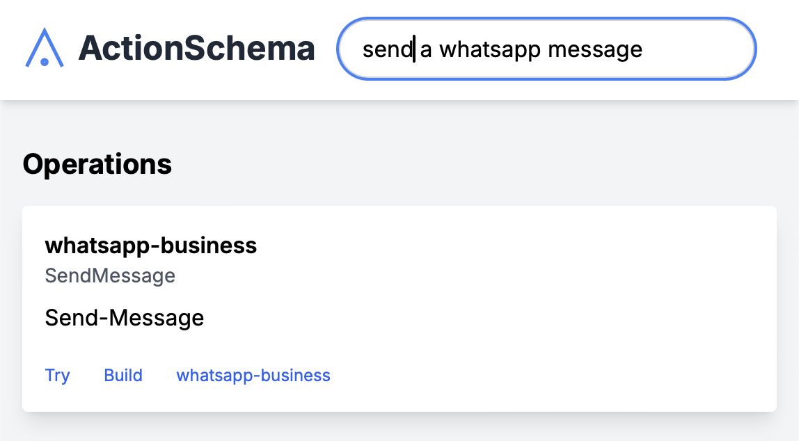
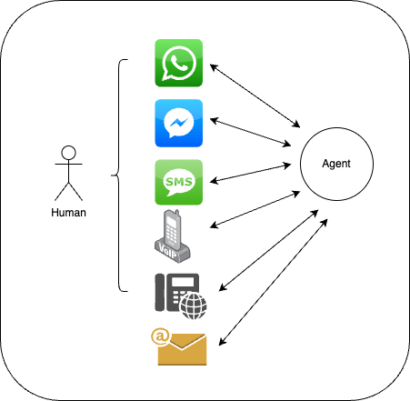
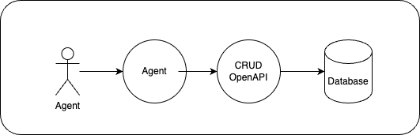

# Missing Building Blocks in the Agent World

["AI Agents will likely be the most impactful technology of our generation"](https://transitivebullsh.it/ai-agents). I'm Wynand and here are some of my current interests.

## OpenAPI Search Engine

OpenAPIs are an elegant way of describing the capability of a system and how to interface with it. A search engine to find operations you need is useful for developers. [Try it here](https://actionschema.com) (early access)

## Agent Identity Provider

Agents need to be authorized to take actions on the internet. I'm building a flexible auth layer allowing for programmatic agent authentication.

<!-- Fix auth and make little gif of actionschema oauth2 login with scope -->

## OpenAPI Chat Completion

<!-- Fix chat and make little gif of me taking an action -->

Turn any API into tools for an agent, Turn any tools-powered chat completion into an API.

OpenAPI Chat Completion serves an OpenAPI for talking to an agent, so it can be discovered publicly, and can be used as a tool for other agents.

## Agent Relay

Agents need to be accessible from anywhere. The Agent Relay makes agents accessible from messaging apps, VoIP and phonecalls, and over email!

## Upstash CRUD OpenAPI

Data needs to be discoverable as tools. A reliable CRUD Agent is extremely useful. [More info here](https://github.com/CodeFromAnywhere/upstash-crud-openapi)

## GitHub OpenAPI

I'm building agents that can understand and search through code or get access to up-to-date knowledge-base.

# More projects

I have many more projects. Check [my repos](https://github.actionschema.com/CodeFromAnywhere) for an overview (private and public). Interested in [working with me or request a demo?](freelance.md)

# Key insights

- We're living through a technological paradigm shift that will change how we interact with computers, and how humans can find purpose. A new foundation is being created now. In this important time, I want to do my part setting good standards for HMC that benefits humanity.
- Big tech capitalism is trying to create a controlled closed ecosystem for AI. As AGI is approaching, misaligned commercial incentives become ever more extreme, and I don't want to live in this walled garden distopia. The solution is an open, accessible, modular ecosystem for AI Agents. An ecosystem without any vendor lock-in or privacy problems. An ecosystem where we, the people, stay in control.
- A dependency to the above is what I call "OpenAPI-first development". It is an opinionated way of [design-first](https://swagger.io/blog/code-first-vs-design-first-api/) development where your OpenAPI serves as the SSOT for a lot of things, and you don't generate it, you rather generate pieces in your code FROM it.
- Most AI is focused around realtime co-pilots because we're all still used to the direct HMC. Try making ambient pilots that don't need to be fast.
- Pick my focus. Big topics like browser automation APIs and video editing are done by hundreds of companies and are extremely hard to stay competitive in; It's a never-ending cat and mouse game.
- Products and APIs change all the time. Instead of choosing to spend knowledgework time in specific niches, index all available capabilities.
- Most users care about their privacy and would want to have things ran locally. However, running locally is hard to setup and scale. Another way to have practical privacy is to keep the core local, but run smaller fleeting tasks in the cloud.
- How any API works exactly doesn't need to be abstracted away from. The only thing we need to do is determine API capability, quality, speed, cost, and availability.

# Let's Code From Anywhere!

This GitHub is currently maintained by [wkarsens](https://x.com/wkarsens) and is part of the [Code From Anywhere](https://codefromanywhere.com/) movement. We are a decentralised applied AI research lab building planet-first & humane-centered applications.

# Commercial License

For all open source work that can be found on this GitHub, if your company generates more than $1,000,000 in Annual Recurring Revenue (ARR), you are required to obtain a commercial license. Please see the [COMMERCIAL_LICENSE](COMMERCIAL_LICENSE.md) file for more information. For commercial licensing inquiries, or other partnerships, please see my [freelancing rules](freelance.md)
