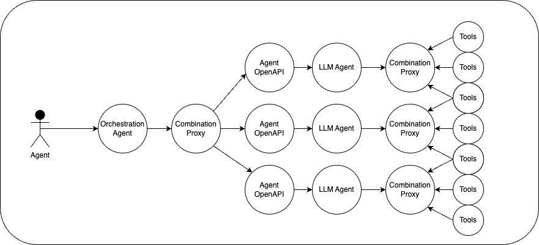
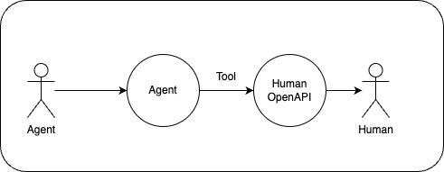
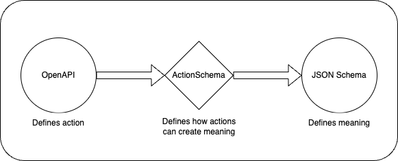

# Missing Building Blocks in the Agent World

## OpenAPI Explorer

A single OpenAPI usually is comprised of many services. To find these services, we've created the [OpenAPI Explorer](https://explorer.actionschema.com) so you can find programmable services (that agents can use) more easily.

## Enhancement Proxy

The Enhancement Proxy improves OpenAPIs, making them error-free and more easy to understand for agents. Make your own enhancement proxy [here](https://openapi.actionschema.com)

## Combination Proxy

The Combination Proxy allows you to create a combination of multiple (subsets of) OpenAPIs, to serve as a new OpenAPI. Make your own combination proxy [here](https://proxy.actionschema.com)

## Agent OpenAPI

Turn any API into an Agent, Turn any Agent into an API.

The Agent OpenAPI serves an OpenAPI for talking to an agent, so it can be discovered publicly, and can be used as a tool for other agents. Make your own agent OpenAPI [here](https://agent.actionschema.com)

## Orchestration Agent

With the above tooling, we can now create an agent that orchestrates certain taks to downstream agents. More on this coming soon.

## Agent Stacking

Taking response time limitations out of the equation, this pattern can be done with infinite recursion. More on this coming soon.

## Agent Relay

Agents need to be accessible from anywhere. The Agent Relay makes agents accessible from messaging apps, VoIP and phonecalls, and over email!

## Human OpenAPI

Agents need to be able to have long interval back-and-forth with humans. Make your own Human OpenAPI [here](https://human.actionschema.com)

## CRUD OpenAPI and Agent

State needs to be discoverable as tools. A reliable CRUD Agent is extremely useful. You can create your own CRUD OpenAPI [here](https://data.actionschema.com)

## State Operations OpenAPI

[ActionSchema](https://github.com/CodeFromAnywhere/ActionSchema) makes it possible to perform operations on items in a list, but it also makes it possible to grow your data into an ever-evolving system using data-centric programming. Check our demo [here](https://demo.actionschema.com)

# Why

- We're living through a technological paradigm shift that will change how we interact with computers, and how humans can find purpose. A new foundation is being created now. In this important time, I want to do my part setting good standards for better HMC.
- Big tech capitalism is trying to create a controlled closed ecosystem for AI. As AGI is approaching, misaligned commercial incentives become ever more extreme, and I don't want to live in this walled garden distopia. The solution is an open, accessible, modular ecosystem for AI Agents. An ecosystem without any vendor lock-in or privacy problems. An ecosystem where we, the people, stay in control.
- Functionally, I don't like most big AI Frameworks like LangChain because they are boilerplate-heavy, ill-tested, buggy, and founded on "hasty abstractions". OpenAPI is a long-standing standard that is not so well adopted yet in the AI world, and this has to change, as it's perfect for the use-case of tools for agents!
- The cost of knowledge work is trending to zero. I might as well put it at zero right now, so I can find my true value elsewhere. Open value creation seems fundamentally better, which is why this project is fully open source.

# Key Focus: Reliable Agents by intelligent search

- Analysing thousands of services on capability, quality, speed, cost, and availability.
- Have a scalable way to sign up and get access to all service providers with multiple accounts.
- Proxy them into my own gateway which can be made available as a "Universal API" that exposes all services through a single endpoint.

Strategy: **ActionSchema** for _Devs_: **OEF**

- Devs want _Open_ source. Give it.
- Devs want _Easy_: Serve it BYOK, accessible, and useful.
- Devs want _Freedom_. Provide them agents so they can go Screenless.

**ActionSchema in different keywords: AI Software Engineer, Universal API, Reliable Agents, OLAM**

TODO: Keep jumping between these projects and aim to finish them asap. **Laserfocus**.

LONGTERM: Keep these stable services for decades. Keep LOC/Complexity LOW.

# Highlevel ActionSchema

This is the current ecosystem of projects developed by Code From Anywhere (❗️ dependency, 🚫 blocked, 🔴 not started, 🟠 work in progress, 🟢 done)

| Name                                                           | Purpose                                                    | Status | POC                                                                                                                                               | LOC  |
| -------------------------------------------------------------- | ---------------------------------------------------------- | ------ | ------------------------------------------------------------------------------------------------------------------------------------------------- | ---- |
| [Agent Relay](https://github.com/CodeFromAnywhere/agent-relay) | Make agent available anywhere                              | 游     | 🟢 Browser & Phonecall STS 🟢 Custom agent compatibility 🟢 Whatsapp, SMS, Messenger 🔴 Email 🔴 Deepgram STS Tool use 🔴 Outbound | 1175 |
| User OpenAPI                                                   | Add User Management to your OpenAPI                        | 🔴 ❗️ | Serve Clerk on https://login.actionschema.com and proxy+extend an OpenAPI                                                                         |      |
| [Combination Proxy](https://proxy.actionschema.com)            | Combine multiple OpenAPIs into one                         | 🔴     | 游 Serve with form to make your own easily. 🔴 Examples of agents.                                                                             | 1300 |
| [Agent OpenAPI](https://agent.actionschema.com)                | Turn any API into an Agent                                 | 🚫     | 🟢 Simple POC 🟢 OpenAPI-centric Refactor 🚫 Threads 🔴 Files 🔴 Agent-Agent                                                          | 1984 |
| [CRUD OpenAPI](https://data.actionschema.com)                  | Turn database into agent-tools                             | 🚫     | 🟢 CRUD Only firsst 🟢 Semantic search 🔴 CLI 🚫 Config: user separation 🔴 ActionSchema integration 🔴 CRUD-Agent                 | 4450 |
| Serverless Browser                                             | Serverless Playwright Browsing OpenAPI                     | Idea   |                                                                                                                                                   |      |
| oAuth2 Authenticator                                           | Automatic signup, login, and payments to gather API access | Idea   |                                                                                                                                                   |      |

A dependency to the above is what I call "OpenAPI-first development". It is an opinionated way of [design-first](https://swagger.io/blog/code-first-vs-design-first-api/) development where your OpenAPI serves as the SSOT for a lot of things, and you don't generate it, you rather generate pieces in your code FROM it. Here are some libraries I've made to allow for this.

| Library                                                                      | Purpose                                                    | Status                                                                                            | LOC  |
| ---------------------------------------------------------------------------- | ---------------------------------------------------------- | ------------------------------------------------------------------------------------------------- | ---- |
| [openapi-util](https://github.com/CodeFromAnywhere/openapi-util)             | Utilities for working with OpenAPI and serving them        | 🟢 make `resolveOpenapiAppRequest`                                                             | 1517 |
| [react-openapi-form](https://github.com/CodeFromAnywhere/react-openapi-form) | Auto-generate forms based on an OpenAPI                    | 🟢 Works, including Type Safety and editability 游 Include component for showing all endpoints | 838  |
| [actionschema](https://github.com/CodeFromAnywhere/ActionSchema)             | Extension of JSON Schema allowing data-centric development | 游 Rewrite to v2 in progress 🔴 x-proxy 🔴 x-schema 🔴 x-code                         | 2904 |

If I feel _fancy_, work on this. More experimental:

| Website                                               | Purpose                                         | Repo              | Status                              | POC or next steps                                                                                                                                        | Depends on                      |
| ----------------------------------------------------- | ----------------------------------------------- | ----------------- | ----------------------------------- | -------------------------------------------------------------------------------------------------------------------------------------------------------- | ------------------------------- |
| OpenAPI Tester                                        |                                                 |                   | Big Wish                            | E2E testing/validating an OpenAPI's functionality                                                                                                        | ActionSchema                    |
|                                                       |                                                 |                   |                                     |                                                                                                                                                          |                                 |
|                                                       |                                                 | procedures        | Brainstorm                          | Natural Language to Operations mapping                                                                                                                   | Good OpenAPI search             |
|                                                       |                                                 |                   | Brainstorm                          | LLM Hierarchy Creation, Maintenance, and Search                                                                                                          |                                 |
| ActionSchema Demo                                     | Show how ActionSchema works                     | actionschema-demo | Paused                              | VSCode plugin for OpenAPI selection and form-filling                                                                                                     | Functional OpenAPI              |
|                                                       |                                                 |                   | Big Wish                            | Slow-agents that can continue very long or self-activate                                                                                                 | ActionSchema                    |
| Universal API                                         | Universal-API or Open-LAM                       |                   | Brainstorm                          | Exposes all services through a single cacheable NLP endpoint                                                                                             | OpenAPI Explorer, Search, Proxy |
| Normalise GPT                                         | Schema Normalisation                            |                   | Brainstorm                          |                                                                                                                                                          |                                 |
| Human OpenAPI                                         | Turn people into agent-tools                    |                   |                                     | User can signup after which the API can communicate with the user                                                                                        | 🟢 Agent Relay, 🔴 User OpenAPI |
| [Enhancement Proxy](https://openapi.actionschema.com) | Allow agents to iteratively improve their tools | 🚫                | Paused. Will be solved by CRUDE     | 🚫 Finish ActionSchema Rewrite 游 Serve on subdomain with frontpage 🔴 Create OpenAPI to self-modify                                               |
| [OpenAPI Explorer](https://explorer.actionschema.com) | Explore OpenAPI Possibilities                   | 🔴                | Paused. Users need their own store. | 🟢 Forms 🟢 Page-per-tag, all forms on tagpage. 🔴 manual entry 🔴 Aggregate openapis from multiple endpoints 🔴 Expose LLM search endpoint. |

# Key insights

- Most AI is focused around realtime co-pilots because we're all still used to the direct HMC. Try making ambient pilots that don't need to be fast.
- Pick my focus. Big topics like browser automation APIs and video editing are done by hundreds of companies and are extremely hard to stay competitive in; It's a never-ending cat and mouse game.
- Products and APIs change all the time. Instead of choosing to spend knowledgework time in specific niches, index all available capabilities.
- Most users care about their privacy and would want to have things ran locally. However, running locally is hard to setup and scale. Another way to have practical privacy is to keep the core local, but run smaller fleeting tasks in the cloud.
- How any API works exactly doesn't need to be abstracted away from. The only thing we need to do is determine API capability, quality, speed, cost, and availability.

## Questions

- Can ActionSchema become agentic: allowing an agent to decompose tasks in parallel and sequential ways?
- How can I build a meta programming language that dynamically finds new actions, tests them, and improves them, that can create purpose-oriented change in a system?
  - How can I measure purpose-oriented change and figure out whether it's worth the cost?

# Let's Code From Anywhere!

Welcome to [Code From Anywhere](https://codefromanywhere.com/) - a group of distributed developers and entrepreneurs building planet-first & humane-centered software. We work remotely but often come together in places like Nepal and Brazil, going on adventures.

We 🤍 Developers, AI Startups & Adventurers. Do you have a question, comment, or want to connect? Head over to our [Discord](https://discord.gg/56yJzjJjHu)

# Contributors and Sponsors

Top contributors

- [Wijnand Karsens](https://karsens.com)
- lonely here... 👀

# License

This project is licensed under the MIT License - see the [LICENSE](LICENSE.md) file for details.

## Commercial License

If your company generates more than $1,000,000 in Annual Recurring Revenue (ARR), you are required to obtain a commercial license. Please see the [COMMERCIAL_LICENSE](COMMERCIAL_LICENSE.md) file for more information.

## Contact

For commercial licensing inquiries, please contact Wijnand at wijnand@karsens.com
